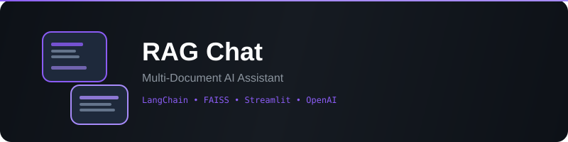

<div align="center">



# RAG Chat

**Chat with your documents using Retrieval-Augmented Generation**

[](https://www.python.org/)
[](https://streamlit.io/)
[](https://www.langchain.com/)
[](https://faiss.ai/)
[](LICENSE)

Upload documents. Ask questions. Get answers with source citations.

</div>

---

## Overview

RAG Chat is a Retrieval-Augmented Generation application that lets you have conversations with your documents. Upload PDFs, Word docs, text files, CSVs, or HTML pages — the system indexes them into a searchable vector database and answers your questions using the most relevant chunks.

**How it works:**

```
Upload Documents → Chunk Text → Embed (HuggingFace) → Store (FAISS)
                                                                ↓
Query → Embed → Similarity Search → Retrieve Top-K Chunks → LLM → Answer
```

---

## Features

| Feature | Description |
|---------|-------------|
| **Multi-Format Support** | PDF, DOCX, TXT, MD, CSV, HTML — drag and drop any of them |
| **Dual LLM Backends** | Use OpenAI (GPT-4o) for cloud or Ollama (Llama 3) for fully local |
| **Source Citations** | Every answer shows which document and chunk it came from |
| **Persistent Chat** | Conversation history with context-aware follow-up questions |
| **Configurable Embeddings** | Uses `all-MiniLM-L6-v2` by default, swappable in code |
| **One-Click Deploy** | Render deployment config included |

---

## Tech Stack

| Layer | Technology | Purpose |
|-------|-----------|---------|
| UI | Streamlit | Interactive chat interface |
| Orchestration | LangChain | Document loading, splitting, retrieval pipeline |
| Vector Store | FAISS (CPU) | Fast similarity search over document embeddings |
| Embeddings | HuggingFace `all-MiniLM-L6-v2` | 384-dim sentence embeddings |
| LLM (Cloud) | OpenAI GPT-4o / GPT-4o-mini | Cloud-based answer generation |
| LLM (Local) | Ollama + Llama 3 | Fully local, no API key needed |
| PDF Parsing | PyMuPDF | High-quality text extraction from PDFs |
| DOCX Parsing | python-docx | Microsoft Word document support |

---

## Quick Start

### Prerequisites

- Python 3.9+
- (Optional) [Ollama](https://ollama.ai) for local LLM support
- (Optional) OpenAI API key for cloud LLM support

### Installation

```bash
git clone https://github.com/vikrambtech2025-png/RAG-type-app.git
cd RAG-type-app
python -m venv venv
source venv/bin/activate   # Windows: venv\Scripts\activate
pip install -r requirements.txt
```

### Run

```bash
streamlit run app.py
```

Open **http://localhost:8501** in your browser.

---

## Usage

1. **Select LLM Backend** — In the sidebar, choose OpenAI or Ollama
2. **Configure API Key** — Enter your OpenAI key, or point to your Ollama instance
3. **Upload Documents** — Drag and drop PDFs, DOCX, TXT, MD, CSV, or HTML files
4. **Ask Questions** — Type your question in the chat input
5. **View Sources** — Click "View sources" under any answer to see the exact chunks used

---

## Project Structure

```
RAG-type-app/
├── app.py              # Streamlit UI — chat interface, file upload, settings
├── rag_engine.py       # Core RAG logic — document processing, FAISS indexing, search
├── requirements.txt    # Python dependencies
├── render.yaml         # Render deployment configuration
└── README.md
```

### How It Works Internally

**`rag_engine.py`** contains two classes:

- **`DocumentProcessor`** — Loads files using format-specific loaders (PyMuPDF for PDF, Docx2txtLoader for DOCX, etc.), then splits them into 1000-character chunks with 200-character overlap using `RecursiveCharacterTextSplitter`.

- **`RAGEngine`** — Manages the FAISS vector store. On first file upload, it creates the index. On subsequent uploads, it adds to the existing index. The `search()` method returns the top-K most similar chunks for any query.

**`app.py`** wires everything into a Streamlit chat UI with sidebar settings, file management, and conversation history.

---

## Configuration

### Environment Variables

| Variable | Required | Default | Description |
|----------|----------|---------|-------------|
| `OPENAI_API_KEY` | No | — | OpenAI API key (can also set in sidebar) |

### LLM Backends

| Backend | Setup | Models | Cost |
|---------|-------|--------|------|
| **OpenAI** | API key required | GPT-4o, GPT-4o-mini | Pay per token |
| **Ollama** | Install Ollama locally | Llama 3, Mistral, etc. | Free |

---

## Deployment

### Render (Recommended)

1. Push this repo to GitHub
2. Go to [render.com](https://render.com) → New Web Service
3. Connect your repo — Render auto-detects `render.yaml`
4. Set `OPENAI_API_KEY` in environment variables (if using OpenAI)
5. Deploy

### Local with Ollama (No API Key Needed)

```bash
# Install Ollama
curl -fsSL https://ollama.ai/install.sh | sh

# Pull a model
ollama pull llama3

# Run the app
streamlit run app.py

# Select "ollama" in the sidebar → done
```

---

## Limitations

- No persistent vector store — index is rebuilt on server restart
- CPU-only embeddings (no GPU acceleration by default)
- Single-user session (Streamlit state is per-browser-tab)
- No authentication (designed for local/personal use)

---

## Contributing

Contributions are welcome! Open an issue or submit a pull request.

## License

MIT

---

<div align="center">

**Built with LangChain + FAISS + Streamlit**

</div>
